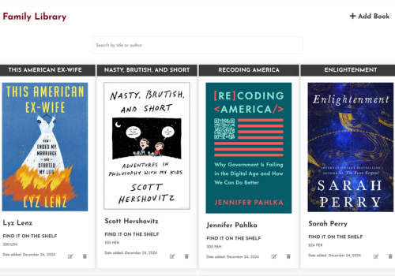
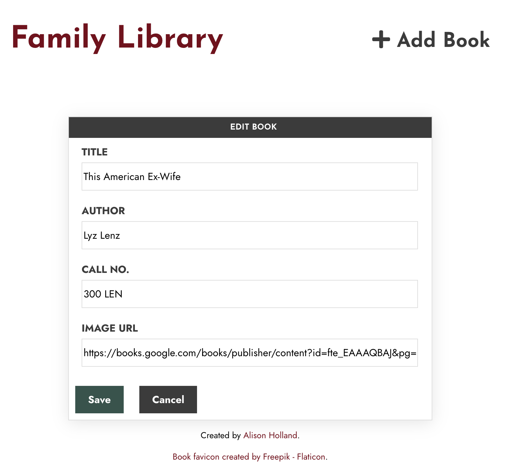

# Family Library App

A simple web application to manage your family's book collection. Built with Flask and SQLite.




## Features

- Add books with title, author, call number and cover image URL
- Search books by title or author
- Edit book details
- Delete books from library
- View all books in a responsive grid layout
- Auto-formatted dates

## Running on Replit

1. Make a copy in your own Replit
2. Click the "Run" button
3. The app will automatically start and be available in the webview
4. Configure your database. The default database is SQLite and has a placeholder that indicates "Database is disconnected." That is because I have found this database set up to be unreliable and moved my deployment to PostgreSQL.

## Dependencies

Core dependencies:
- Flask (v2.2.0)
- Flask-SQLAlchemy (v3.0.3) 
- urllib3
- psycopg2-binary

Frontend dependencies (loaded via CDN):
- jQuery - For AJAX requests and DOM manipulation
- Font Awesome - For icons
- SweetAlert2 - For modal dialogs/alerts

## Directory Structure

```
├── instance/         # SQLite database
│   └── book.db
├── static/          # Static assets
│   ├── book.html    # Main page
│   ├── book.css     # Styles
│   └── book.js      # Frontend JavaScript
├── main.py          # Flask application
└── README.md        # This file
```

## API Endpoints

- `GET /api/books/` - Get all books
- `GET /api/books/search?q=query` - Search books
- `POST /api/books/add` - Add new book
- `POST /api/books/delete` - Delete book
- `POST /api/books/edit` - Edit book details

## Future improvements
- Improve accessibility of edit and delete buttons

## Acknowledgements
- This project is an iteration on the female supervillain trading card app and recipe app <a href="https://skillcrush.com/" target="_blank">Skillcrush</a> projects.
